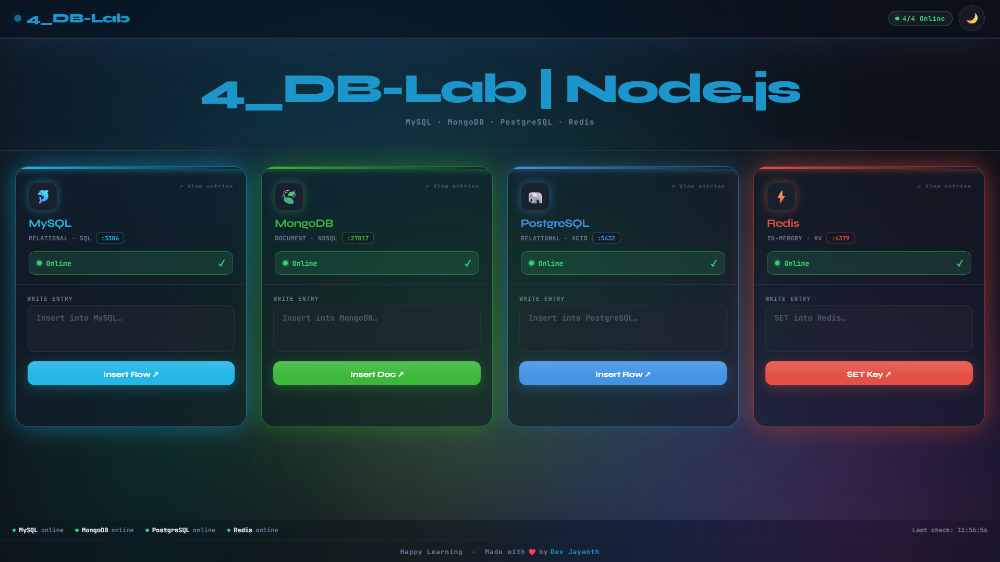

# 🗄️4_DB-Lab | 🚀Node.js


**Happy Learning — Made with ❤️ by Dev Jayanth**

---

## What Is This?

4_DB-Lab is a learning project designed to teach you how to deploy a real multi-service application from scratch.

The app connects to **MySQL**, **MongoDB**, **PostgreSQL**, and **Redis** at the same time. The UI shows live connection status for each database and lets you interact with all four from a single page.

---

## The Challenge

Get this application running. Every service — Node.js, MySQL, PostgreSQL, Redis, MongoDB, and nginx — must be installed and configured by you. The app should be accessible from a browser.

---

## Project Structure

```
4_DB-Nodejs/
├── backend/
│   ├── server.js          # Express API — reads DB config from environment variables
│   └── package.json       # Dependencies: express, mysql2, pg, redis, mongoose
├── frontend/
│   ├── index.html         # Single-file UI — no build step needed
│   └── nginx.conf         # nginx site config — serves the UI and proxies /api/*
├── Dockerfile
└── docker-compose.yml
```

---

## How the App Works

- The **backend** (`server.js`) is a Node.js/Express API. It reads all database connection details from **environment variables**.
- The **frontend** (`index.html`) is a static single-page app served by **nginx**. nginx also proxies all `/api/*` requests to the Node.js backend running on port `3000`.
- The UI polls `/api/status` every 5 seconds to show live connection state for each database.

---

## Environment Variables the App Expects

Set these before starting the Node.js process:

| Variable | Description |
|---|---|
| `PORT` | Port for the Node.js server (default `3000`) |
| `MYSQL_HOST` | MySQL hostname |
| `MYSQL_PORT` | MySQL port |
| `MYSQL_USER` | MySQL username |
| `MYSQL_PASSWORD` | MySQL password |
| `MYSQL_DATABASE` | MySQL database name |
| `PG_HOST` | PostgreSQL hostname |
| `PG_PORT` | PostgreSQL port |
| `PG_USER` | PostgreSQL username |
| `PG_PASSWORD` | PostgreSQL password |
| `PG_DATABASE` | PostgreSQL database name |
| `REDIS_HOST` | Redis hostname |
| `REDIS_PORT` | Redis port |
| `REDIS_PASSWORD` | Redis password |
| `MONGO_URI` | Full MongoDB connection URI |

---

## API Endpoints

| Method | Route | Description |
|---|---|---|
| `GET` | `/api/status` | Connection state of all 4 databases |
| `POST` | `/api/mysql/write` | Insert a row — body: `{ "content": "..." }` |
| `GET` | `/api/mysql/entries` | List all rows |
| `DELETE` | `/api/mysql/entries/:id` | Delete a row |
| `POST` | `/api/postgres/write` | Insert a row |
| `GET` | `/api/postgres/entries` | List all rows |
| `DELETE` | `/api/postgres/entries/:id` | Delete a row |
| `POST` | `/api/redis/write` | Set a key |
| `GET` | `/api/redis/entries` | List all `entry:*` keys |
| `DELETE` | `/api/redis/entries/:key` | Delete a key |
| `POST` | `/api/mongo/write` | Insert a document |
| `GET` | `/api/mongo/entries` | List all documents |
| `DELETE` | `/api/mongo/entries/:id` | Delete a document by ObjectId |

All responses return `{ ok: true/false, ... }`. Write requests expect `Content-Type: application/json`.

---

## Hints

**Node.js**
- The project uses Node.js 20. Make sure you install the correct version — the default version in most distro package managers is outdated.
- Run `npm install` inside the `backend/` folder before starting the server.
- The server does not daemonize itself. You need a way to keep it running after you close your terminal.

**MySQL**
- After installation, the root account may use socket authentication by default — you will need to create a separate app user with password authentication.
- Grant the app user full privileges on the app database only, not globally.
- The app creates its own tables on first connection. You only need to create the database and the user.

**PostgreSQL**
- The default `postgres` superuser uses peer authentication. Create a dedicated app user with password authentication (`md5` or `scram-sha-256`).
- Make sure `pg_hba.conf` allows password-based login for your app user from `localhost`.
- Like MySQL, the app creates its own tables — you only need the database and the user.

**Redis**
- By default Redis has no password and listens only on localhost. You need to enable password authentication — look at the `requirepass` directive in `redis.conf`.
- After changing the config, Redis needs to be restarted for it to take effect.

**MongoDB**
- Enable authentication when setting up MongoDB (`--auth` or via config). Without it the `MONGO_URI` with credentials will still connect but anyone can access it.
- Create the app user inside the `admin` database (`authSource=admin`), not the app database — that is what the connection URI in this project expects.
- The app auto-creates its collection on first write.

**nginx**
- nginx should serve `frontend/index.html` as the root and proxy any request starting with `/api/` to the Node.js process.
- The provided `nginx.conf` is written for this purpose — study it before writing your own config or placing it in the right location.
- Make sure nginx starts after Node.js is already running.

---

## Tech Stack

| Layer | Technology |
|---|---|
| Runtime | Node.js 20 |
| Framework | Express |
| Databases | MySQL 8 · PostgreSQL 16 · Redis 7 · MongoDB 7 |
| Web server | nginx |

---

## License

MIT — use freely, learn freely.